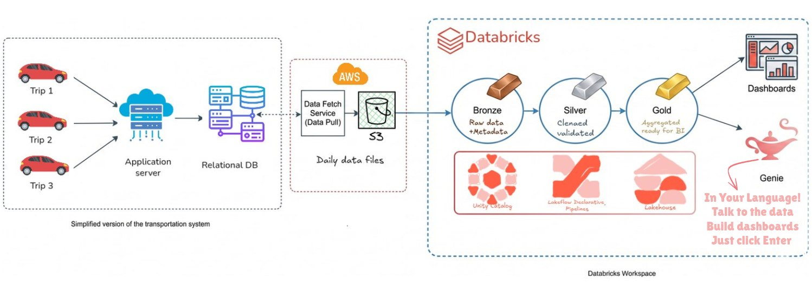
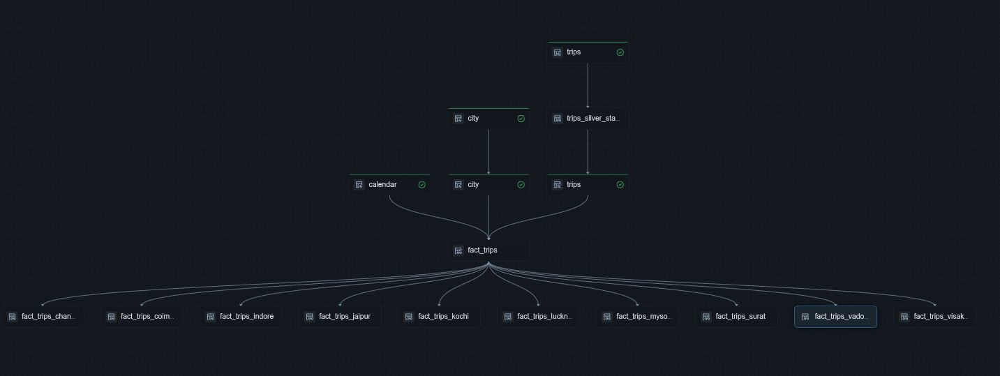
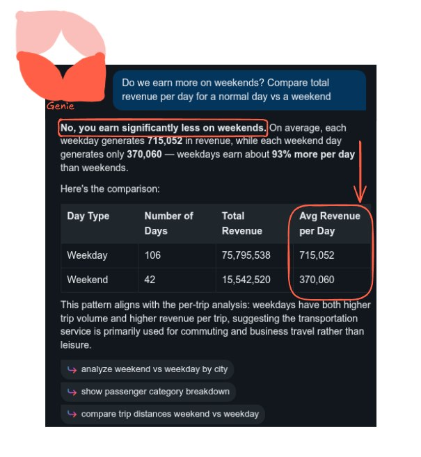
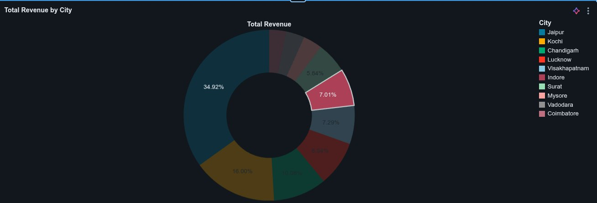

# 🚕 GoodCabs — End-to-End Data Engineering Solution on Databricks

*Declarative lakehouse pipelines for region-specific transportation analytics, powered by LakeFlow Spark Declarative Pipelines (SDP) and AI-Powered Analytics with Genie.*

---

## 📖 Overview

**GoodCabs** is an Uber-like ride-hailing company operating across **10 Indian cities** — Jaipur, Kochi, Chandigarh, Lucknow, Visakhapatnam, Indore, Surat, Mysore, Vadodara, and Coimbatore. Every day, thousands of trips generate data (fares, ratings, distances, passenger types) that regional managers depend on for operational decisions.

This project builds a **complete data engineering solution** on the **Databricks Lakehouse Platform** (Free Edition) that ingests raw CSV trip files from **Amazon S3**, transforms them through a **Medallion Architecture** (Bronze → Silver → Gold), and delivers **per-city analytics views** so each regional manager sees only the data relevant to their city — with row-level governance enforced by **Unity Catalog**.

<p align="center">
  
</p>
<p align="center"><em>End-to-end architecture — from the OLTP source system through AWS S3 to the Databricks Lakehouse</em></p>

---

## 🎯 Goals / Problem Statement

Regional managers faced three recurring pain points:

| Pain Point | Root Cause |
|---|---|
| 📉 **Late data** — dashboards refreshed too slowly | Manual, imperative Spark pipelines with no incremental loading |
| 📊 **Generic dashboards** — no regional focus | A single monolithic view for all cities; no access control |
| 🔄 **Manual rework** — teams re-exported data by hand | No automated orchestration or dependency management |

**This project solves all three** by moving to a **declarative pipeline paradigm** where you declare *what* to do and Spark determines *how* — with automatic dependency resolution, incremental streaming ingestion, and Unity Catalog row-level security.

---

## 🛠️ Tech Stack

| Component | Technology |
|---|---|
| **Cloud Platform** | Databricks (Free Edition) on AWS |
| **Object Storage** | Amazon S3 |
| **Pipeline Engine** | LakeFlow Spark Declarative Pipelines (SDP) |
| **Ingestion** | Auto Loader (`cloudFiles`) for streaming |
| **Table Format** | Delta Lake |
| **Governance** | Unity Catalog (RBAC, row-level security) |
| **Languages** | Python (PySpark) · SQL |
| **AI Analytics** | Databricks Genie (Natural Language → SQL) |

---

## 🏗️ Approach / Design

The solution follows the **Medallion Architecture** — a proven layered data design pattern:

```
   ┌─────────────────┐      ┌──────────────────┐      ┌──────────────────┐
   │   🥉 BRONZE     │      │   🥈 SILVER      │      │   🥇 GOLD        │
   │   Raw Ingestion │ ───► │   Cleaned &      │ ───► │   Business-Ready │
   │   + Metadata    │      │   Validated      │      │   Views          │
   └─────────────────┘      └──────────────────┘      └──────────────────┘
```

**Data Model:**

- **Fact Table:** `trips` — trip_id, fare, ratings, distance, passenger type, city
- **Dimension:** `city` — city_id, city_name
- **Dimension:** `calendar` — programmatically generated date dimension with Indian holidays

**Key Design Decisions:**

1. **Declarative over Imperative** — Instead of writing procedural Spark jobs, every transformation is a decorated Python/SQL function. SDP auto-builds the dependency graph, manages retries, and handles out-of-order data.
2. **Streaming + Batch hybrid** — Dimensions (`city`, `calendar`) use **Materialized Views** (batch); the `trips` fact uses a **Streaming Table** with Auto Loader for incremental file detection.
3. **Auto CDC (Change Data Capture)** — SCD Type 1 upserts on the silver `trips` table with a single `dp.create_auto_cdc_flow()` call — replacing ~135 lines of manual `MERGE` logic with ~50 lines of declarative code.

---

## 🚀 Implementation

### 1. Project Setup & Catalog Creation

A setup notebook creates the **Unity Catalog** structure — one catalog (`transportation`) with three schemas mirroring the medallion layers:

```sql
CREATE CATALOG IF NOT EXISTS transportation;
CREATE SCHEMA IF NOT EXISTS transportation.bronze;
CREATE SCHEMA IF NOT EXISTS transportation.silver;
CREATE SCHEMA IF NOT EXISTS transportation.gold;
```

### 2. S3 Data Landing Zone

Raw CSV files are uploaded to an **S3 bucket** organized as:

```
s3://goodcabs/data-store/
├── city/
│   └── city.csv                     ← dimension (single file)
└── trips/
    ├── trip_export_2025-08-01.csv    ← 148 daily files (full load)
    ├── trip_export_2025-08-02.csv
    │   ...
    └── trip_export_2025-12-31.csv    ← 5 files (incremental load)
```

Databricks is connected to S3 via an **External Location** provisioned through a CloudFormation Quick Start stack with a personal access token.

### 3. 🥉 Bronze Layer — Raw Ingestion

**City** (`bronze/city.py`): A `@dp.materialized_view` reads the CSV with `PERMISSIVE` mode, captures `_corrupt_record` for data quality, and adds `file_name` + `ingest_datetime` metadata columns.

**Trips** (`bronze/trips.py`): A `@dp.table` (Streaming Table) uses **Auto Loader** (`cloudFiles`) to detect and process only *new* files incrementally:

```python
spark.readStream.format("cloudFiles")
    .option("cloudFiles.format", "csv")
    .option("cloudFiles.inferColumnTypes", "true")
    .option("cloudFiles.schemaEvolutionMode", "rescue")
    .option("cloudFiles.maxFilesPerTrigger", 100)
    .load(SOURCE_PATH)
```

> The problematic column `distance_travelled(km)` is renamed to `distance_travelled_km` to avoid special-character issues in downstream queries.

### 4. 🥈 Silver Layer — Cleaning & Validation

**City** (`silver/city.py`): Selects clean columns, renames `ingest_datetime` → `bronze_ingest_timestamp`, and adds `silver_processed_timestamp`.

**Calendar** (`silver/calendar.py`): A programmatically generated date dimension using `sequence()` + `explode()`. Derives 17 columns including `day_of_week`, `quarter_year`, `is_weekend`, and Indian national holidays (Republic Day, Independence Day, Gandhi Jayanti). Configuration-driven via pipeline settings for `start_date` and `end_date`.

**Trips** (`silver/trips.py`): The most sophisticated transformation — a two-stage pipeline:

1. **Staging View** with **data quality expectations**:
   ```python
   @dp.expect("valid_date", "year(business_date) >= 2020")
   @dp.expect("valid_driver_rating", "driver_rating BETWEEN 1 AND 10")
   @dp.expect("valid_passenger_rating", "passenger_rating BETWEEN 1 AND 10")
   ```

2. **Auto CDC Flow** for SCD Type 1 upserts:
   ```python
   dp.create_auto_cdc_flow(
       target="transportation.silver.trips",
       source="trips_silver_staging",
       keys=["id"],
       sequence_by=F.col("silver_processed_timestamp"),
       stored_as_scd_type=1,
   )
   ```

### 5. 🥇 Gold Layer — Business-Ready Views

**Unified Fact View** (`gold/trips_gold.sql`): A denormalized SQL view joining `silver.trips ⨝ silver.city ⨝ silver.calendar` to produce a single analytical surface with trip metrics, city names, and time attributes.

**Per-City Views** — 10 filtered views (one per city), enabling region-specific dashboards:

```sql
CREATE OR REPLACE VIEW transportation.gold.fact_trips_vadodara AS
SELECT * FROM transportation.gold.fact_trips
WHERE city_id = 'GJ02';
```

Cities covered: `Chandigarh · Coimbatore · Indore · Jaipur · Kochi · Lucknow · Mysore · Surat · Vadodara · Visakhapatnam`

### 6. Pipeline Orchestration & DAG

SDP **automatically resolves dependencies** from the code — no explicit DAG definition needed. The resulting dependency graph flows seamlessly from bronze ingestion through silver transformations to gold analytical views:

<p align="center">
  
</p>
<p align="center"><em>Auto-generated pipeline DAG — dependencies are inferred from declarative code, not manually wired</em></p>

**Execution Modes:**

| Mode | Behavior |
|---|---|
| **Triggered** | One-shot run; processes all pending data, then stops |
| **Continuous** | Listens for new S3 files in real-time; auto-propagates through all layers |
| **Scheduled** | Cron-based runs (e.g., daily at 4:00 AM) with pipeline state notifications |

### 7. 🔐 Access Control with Unity Catalog

Unity Catalog enforces **row-level security** through gold views:

1. Create user **groups** per city (e.g., `vadodara_team`).
2. Grant `SELECT` privileges on the corresponding gold view to that group.
3. Regional managers see *only* their city's data — no cross-city leakage.

### 8. 🤖 AI-Powered Analytics with Genie

Databricks **Genie** turns natural language into SQL queries over the gold views — enabling managers to ask questions in plain English without writing a single line of code:

<p align="center">
  
</p>
<p align="center"><em>Genie answers "Do we earn more on weekends?" with full data breakdown and follow-up suggestions</em></p>

<p align="center">
  
</p>
<p align="center"><em>Genie auto-generates a revenue-by-city donut chart — Jaipur leads at 34.92%</em></p>

---

## 📊 Results / Outcomes

| Metric | Before (Imperative) | After (Declarative SDP) |
|---|---|---|
| **Pipeline code** | ~135 lines for silver CDC alone | ~50 lines total (≈63% reduction) |
| **Orchestration** | Manual dependency wiring | Auto-built from code |
| **Incremental load** | Custom checkpoint logic | Built-in Auto Loader |
| **Data freshness** | Daily batch (manual trigger) | Real-time continuous or scheduled |
| **Access control** | None (single shared view) | Per-city RBAC via Unity Catalog |
| **Ad-hoc analytics** | Requires SQL expertise | Natural language via Genie |

---

## 📁 Repository Structure

```
project_assets/
├── 📄 README.md                          ← You are here
├── code/
│   ├── project_setup.ipynb               ← Catalog & schema creation
│   ├── bronze/
│   │   ├── city.py                       ← City dimension ingestion (Materialized View)
│   │   └── trips.py                      ← Trips streaming ingestion (Auto Loader)
│   ├── silver/
│   │   ├── city.py                       ← Cleaned city dimension
│   │   ├── calendar.py                   ← Generated date dimension with Indian holidays
│   │   └── trips.py                      ← Validated trips with Auto CDC (SCD Type 1)
│   └── gold/
│       ├── trips_gold.sql                ← Unified denormalized fact view
│       ├── trips_chandigarh.sql          ← Per-city filtered views
│       ├── trips_coimbatore.sql
│       ├── trips_indore.sql
│       ├── trips_jaipur.sql
│       ├── trips_kochi.sql
│       ├── trips_lucknow.sql
│       ├── trips_mysore.sql
│       ├── trips_surat.sql
│       ├── trips_vadodara.sql
│       └── trips_visakhapatnam.sql
├── data/
│   ├── city/
│   │   └── city.csv                      ← City dimension source
│   └── trips/
│       ├── Full Load/                    ← 148 daily CSVs (Aug–Dec 2025)
│       └── Incremental Load/             ← 5 CSVs for testing incremental ingestion
├── images/
│   ├── pipeline.png                      ← End-to-end architecture diagram
│   ├── DAG.png                           ← Auto-generated pipeline dependency graph
│   ├── Genie.png                         ← Genie NL analytics demo
│   └── chart-with-Genie.png             ← Genie chart generation demo
└── context/
    └── My notes on Transportation Project.md
```

---

## ⚙️ Getting Started

### Prerequisites

- **Databricks account** — [Free Edition](https://www.databricks.com/try-databricks) (no credit card required)
- **AWS account** — for S3 bucket provisioning

### Setup Steps

1. **Create an S3 bucket** with a globally unique name and upload data:
   ```
   s3://<your-bucket>/data-store/city/city.csv
   s3://<your-bucket>/data-store/trips/*.csv
   ```

2. **Connect Databricks to S3** — Catalog → External Data → Create External Location → generate a Personal Access Token → deploy the CloudFormation stack.

3. **Run `project_setup.ipynb`** — creates the `transportation` catalog and `bronze`, `silver`, `gold` schemas.

4. **Create a LakeFlow Declarative Pipeline** — Jobs & Pipelines → ETL Pipeline → point to the `transformations/` folder.

5. **Configure pipeline settings** — add `start_date` and `end_date` keys for the calendar dimension.

6. **Run the pipeline** — SDP auto-resolves all dependencies and executes Bronze → Silver → Gold.

7. **Optional: Enable Continuous Mode** — for real-time incremental ingestion of new trip files.

---

## 🧭 Future Work

- 📈 **Power BI / Tableau integration** — connect BI tools directly to gold views for rich dashboards.
- 🧠 **ML feature store** — leverage gold tables as feature sources for predictive models (e.g., demand forecasting)

---

## 👤 Author

**Mahmoud Abdelrahman**

📧 [mahmoudabdelrahman72@gmail.com](mailto:mahmoudabdelrahman72@gmail.com)
